# 📖 Documentation explicatif du CI/CD - BobApp

📌 Introduction
Ce document décrit en détail le workflow CI/CD pour le frontend du projet. Il comprend les étapes suivantes :

* Tests et couverture du code
* Analyse de la qualité du code avec SonarCloud
* Création et déploiement d'une image Docker

L'objectif est de garantir la stabilité, la qualité et la sécurité du code avant tout déploiement.

## Le Front-End

🎯 Déclencheurs (on)
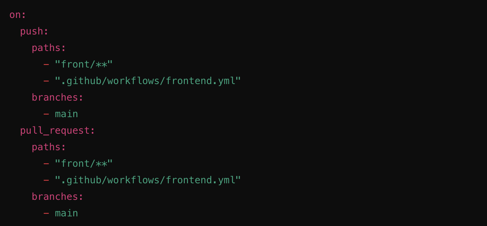
✅ Ce workflow s’exécute lorsque :

* Un push est effectué sur main, uniquement si des fichiers du frontend (front/) ou du workflow GitHub (frontend.yml) sont modifiés.
* Une pull request est créée ou mise à jour vers main, avec des changements sur le frontend.

🏗️ Jobs
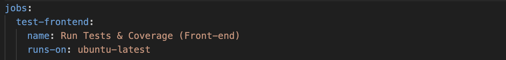

1️⃣ test-frontend - Exécute les tests & la couverture de code

OBJECTIF : Vérifier que le code fonctionne correctement et générer un rapport de couverture.

* 1.1 Cloner le dépôt (1ere étape)
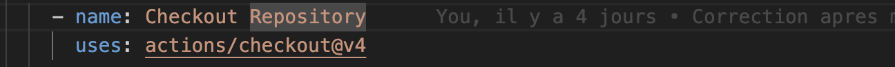
📌 Récupère le code source du projet depuis GitHub.

* 1.2 Installer Node.js
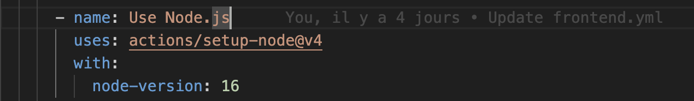
📌 Installe Node.js v16, nécessaire pour exécuter Angular et les tests.

* 1.3 Installer les dépendances & exécuter les tests
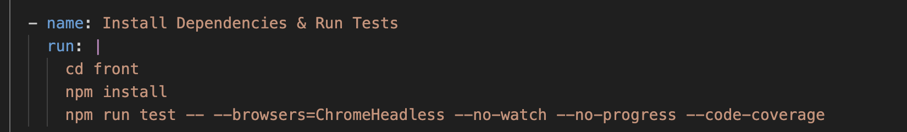
📌 Commandes exécutées :
 * Installation des dépendances → npm install
 * Exécution des tests → npm run test avec :
  --browsers=ChromeHeadless : Exécute Chrome sans interface graphique.
  --code-coverage : Génère un rapport de couverture.

* 1.4 Sauvegarde du rapport de couverture

📌 Sauvegarde le rapport de couverture de code sous le nom angular-coverage.

2️⃣ sonar-frontend - Analyse SonarQube
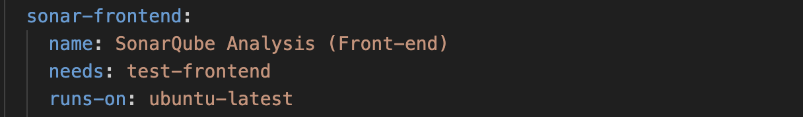
📌 Ce job démarre uniquement si test-frontend est réussi.

* 2.1 Cloner le dépôt
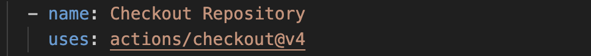
📌 Recloner le code source pour SonarCloud.

* 2.2 Mettre en cache SonarQube

📌 Met en cache les fichiers SonarQube pour accélérer les futures exécutions.

* 2.3 Télécharger le rapport de couverture

📌 Télécharge le rapport de couverture généré précédemment.

* 2.4 Exécuter l'analyse SonarCloud
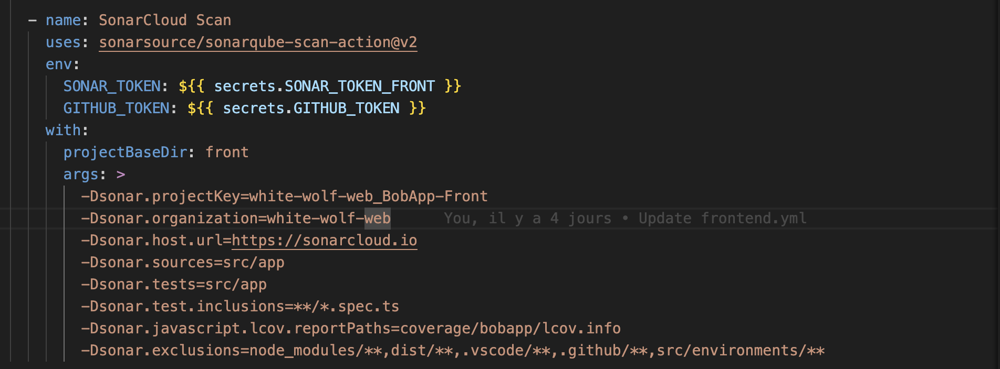
📌 Analyse la qualité du code via SonarCloud en vérifiant :
Le code source (src/app)
Les tests (src/app/*.spec.ts)
Le rapport de couverture (coverage/bobapp/lcov.info)

3️⃣ build-and-push-frontend - Création & Déploiement Docker
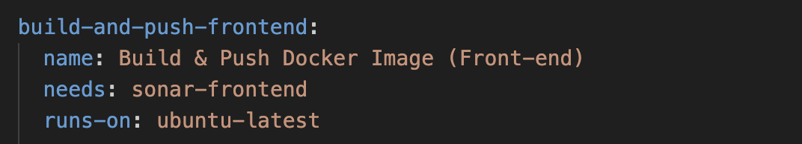
📌 Démarre uniquement après l'analyse SonarQube.

* 3.1 Cloner le dépôt
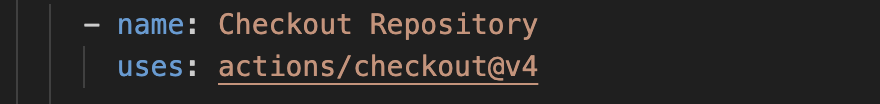
📌 Recloner le dépôt pour la construction de l’image Docker.

* 3.2 Se connecter à Docker Hub
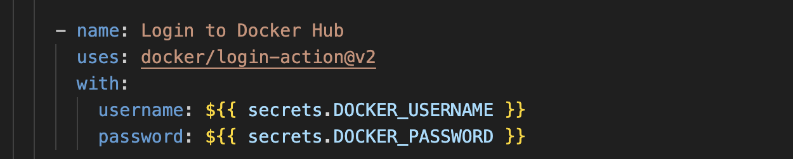
📌 Se connecte à Docker Hub en utilisant les secrets GitHub.

* 3.3 Construire et envoyer l’image Docker
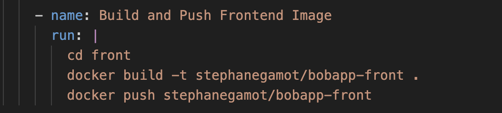
📌 Commandes exécutées :

Créer l’image Docker → docker build -t stephanegamot/bobapp-front .
Envoyer l’image sur Docker Hub → docker push stephanegamot/bobapp-front

✅ Résumé

1️⃣ Test du frontend :
Installe les dépendances.
Exécute les tests unitaires et génère un rapport de couverture.

2️⃣ Analyse SonarQube :
Vérifie la qualité du code et les tests.
Génère un rapport sur SonarCloud.

3️⃣ Déploiement Docker :
Construit une image Docker du frontend.
Pousse l’image sur Docker Hub.

Ce pipeline CI/CD garantit que le code frontend est testé, analysé et packagé avant d’être utilisé en production. 