# 📖 Documentation explicatif du CI/CD - BobApp

📌 Introduction
Ce document décrit en détail le workflow CI/CD pour le frontend du projet. Il comprend les étapes suivantes :

* Tests et couverture du code
* Analyse de la qualité du code avec SonarCloud
* Création et déploiement d'une image Docker

L'objectif est de garantir la stabilité, la qualité et la sécurité du code avant tout déploiement.

## Le Front-End

🎯 Déclencheurs (on)

✅ Ce workflow s’exécute lorsque :

* Un push est effectué sur main, uniquement si des fichiers du frontend (front/) ou du workflow GitHub (frontend.yml) sont modifiés.
* Une pull request est créée ou mise à jour vers main, avec des changements sur le frontend.

🏗️ Jobs

1️⃣ test-frontend - Exécute les tests & la couverture de code

OBJECTIF : Vérifier que le code fonctionne correctement et générer un rapport de couverture.

* 1.1 Cloner le dépôt (1ere étape)

📌 Récupère le code source du projet depuis GitHub.

* 1.2 Installer Node.js

📌 Installe Node.js v16, nécessaire pour exécuter Angular et les tests.

* 1.3 Installer les dépendances & exécuter les tests

📌 Commandes exécutées :
 * Installation des dépendances → npm install
 * Exécution des tests → npm run test avec :
  --browsers=ChromeHeadless : Exécute Chrome sans interface graphique.
  --code-coverage : Génère un rapport de couverture.

* 1.4 Sauvegarde du rapport de couverture

📌 Sauvegarde le rapport de couverture de code sous le nom angular-coverage.

2️⃣ sonar-frontend - Analyse SonarQube

📌 Ce job démarre uniquement si test-frontend est réussi.

* 2.1 Cloner le dépôt

📌 Recloner le code source pour SonarCloud.

* 2.2 Mettre en cache SonarQube

📌 Met en cache les fichiers SonarQube pour accélérer les futures exécutions.

* 2.3 Télécharger le rapport de couverture

📌 Télécharge le rapport de couverture généré précédemment.

* 2.4 Exécuter l'analyse SonarCloud

📌 Analyse la qualité du code via SonarCloud en vérifiant :
Le code source (src/app)
Les tests (src/app/*.spec.ts)
Le rapport de couverture (coverage/bobapp/lcov.info)

3️⃣ build-and-push-frontend - Création & Déploiement Docker

📌 Démarre uniquement après l'analyse SonarQube.

* 3.1 Cloner le dépôt

📌 Recloner le dépôt pour la construction de l’image Docker.

* 3.2 Se connecter à Docker Hub

📌 Se connecte à Docker Hub en utilisant les secrets GitHub.

* 3.3 Construire et envoyer l’image Docker

📌 Commandes exécutées :

Créer l’image Docker → docker build -t stephanegamot/bobapp-front .
Envoyer l’image sur Docker Hub → docker push stephanegamot/bobapp-front

✅ Résumé

1️⃣ Test du frontend :
Installe les dépendances.
Exécute les tests unitaires et génère un rapport de couverture.

2️⃣ Analyse SonarQube :
Vérifie la qualité du code et les tests.
Génère un rapport sur SonarCloud.

3️⃣ Déploiement Docker :
Construit une image Docker du frontend.
Pousse l’image sur Docker Hub.

Ce pipeline CI/CD garantit que le code frontend est testé, analysé et packagé avant d’être utilisé en production. 

## Le Back-End

🎯 Déclencheurs (on)
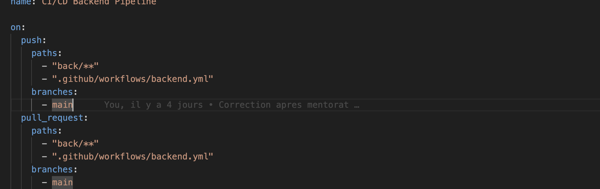
✅ Ce workflow s’exécute lorsque :
 * Un push est effectué sur main et que des fichiers du backend (back/) ou du workflow (backend.yml) sont modifiés.
 *  Une pull request est créée ou mise à jour vers main, incluant des changements dans back/.

 🏗️ Jobs
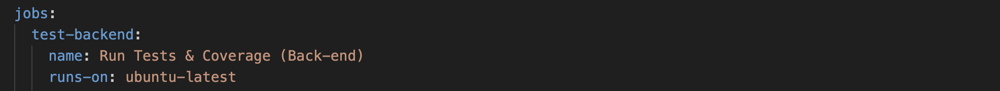

1️⃣ test-Back-end- Exécute les tests & la couverture de code

OBJECTIF: Vérifier que le code fonctionne et générer un rapport de couverture de test.

* 1.1 Cloner le dépôt (1ere étape)
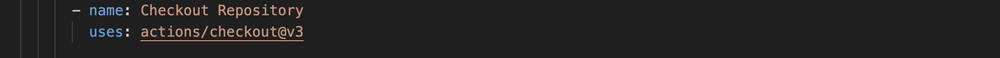

* 1.2 Installer Java 11
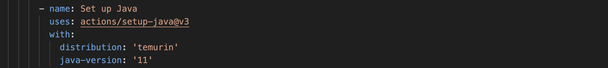
📌 Installe Java 11 (Temurin), nécessaire pour exécuter le backend sous Spring Boot.
📌 Récupère le code source du projet depuis GitHub.

* 1.3 Installer les dépendances et exécuter les tests
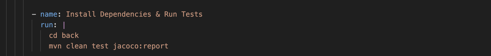
  * mvn clean test : Nettoie le projet et exécute les tests unitaires.
  * jacoco:report : Génère un rapport de couverture de test avec JaCoCo.

* 1.4 Sauvegarder le rapport de couverture
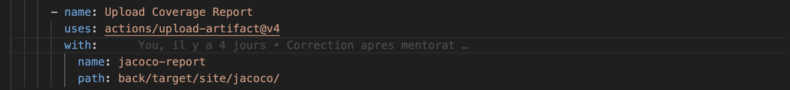
📌 Le fichier est sauvegardé sous le nom jacoco-report pour être utilisé par SonarCloud.

2️⃣ Analyse SonarQube (sonar-backend)
📌 Objectif : Vérifier la qualité du code backend et identifier d'éventuels problèmes.
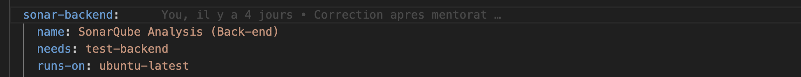
📌 Ce job démarre uniquement si test-backend est réussi.

2.1 Cloner le dépôt
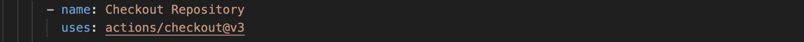
📌 Télécharge le code source pour permettre l’analyse par SonarCloud.

2.2 Installer Java 17
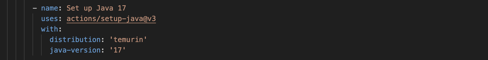
📌 Nécessaire pour la compilation et l’analyse SonarCloud.

2.3 Compiler le projet
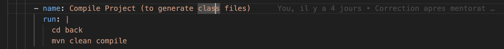
📌 Compile le projet pour générer les fichiers .class nécessaires à SonarCloud.

2.4 Exécuter l’analyse SonarCloud
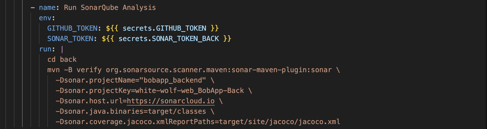
📌  Analyse de la qualité du code backend :
Détection des bugs et vulnérabilités
Vérification des duplications
Évaluation de la maintenabilité et de la couverture des tests
Affichage du rapport SonarCloud

3️⃣ Création & Déploiement Docker (build-and-push-backend)
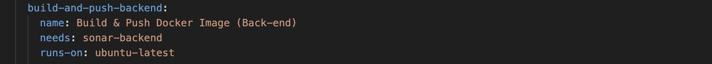
📌 Objectif : Créer une image Docker du backend et la publier sur Docker Hub.

3.1 Cloner le dépôt
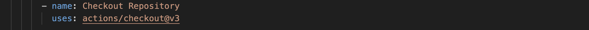
📌 Télécharge à nouveau le code source pour Docker.

3.2 Se connecter à Docker Hub

📌 Connexion à Docker Hub avec les credentials stockés dans les secrets GitHub.

3.3 Construire et envoyer l’image Docker
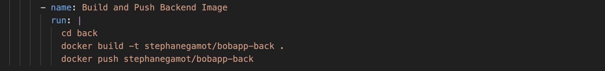
📌 Créer l’image Docker bobapp-back
📌 Envoyer l’image sur Docker Hub pour qu’elle soit accessible en production

✅ Résumé

1️⃣ Test du backend :
Installe les dépendances.
Exécute les tests unitaires et génère un rapport de couverture.

2️⃣ Analyse SonarQube :
Vérifie la qualité du code et les tests.
Génère un rapport sur SonarCloud.

3️⃣ Déploiement Docker :
Construit une image Docker du backend.
Pousse l’image sur Docker Hub.

Ce pipeline CI/CD garantit que le code backend est testé, analysé et packagé avant d’être utilisé en production. 

## L'importance de ce WorkFlow
✅ Automatisation → Plus besoin de tester et d’analyser le code manuellement.
✅ Qualité du code → Vérification continue via SonarCloud.
✅ Sécurité → Prévention des vulnérabilités et des bugs critiques.
✅ Déploiement rapide → L’image Docker est prête à être utilisée en production.

## Indicateurs de performance (KPIs)
 * KPI 1 - Couverture de Code (Code Coverage)
📌 Seuil minimal : 80%
La couverture de code est un indicateur clé mesurant le pourcentage du code qui est testé via les tests unitaires.
Un bon niveau de couverture assure que le code est bien testé et limite les risques de régressions.

INFO :
Maintenir une couverture de code supérieure à 80% pour garantir une bonne qualité du code.
Si ce seuil est inférieur à 80%, l’analyse SonarCloud échouera.

 * KPI 2 - Taux de Réussite des Builds
📌 Seuil minimal : 95%
Le taux de réussite des builds reflète la stabilité du projet en s'assurant que les tests et analyses ne rencontrent pas d'erreurs.

INFO:
Maintenir un taux de réussite supérieur à 95%.
Identifier rapidement les erreurs bloquantes et éviter les régressions.

## Analyses des métriques

### La couverture du code 
  * FrontEnd
  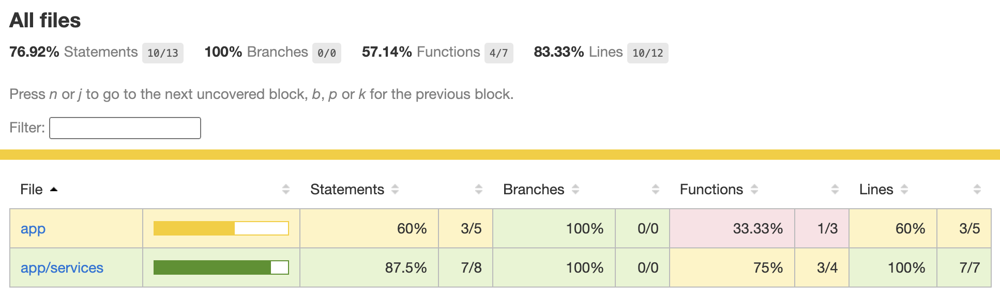

  

  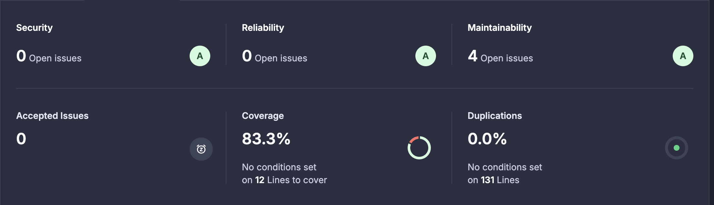
Analyse :
* La couverture de code actuelle est inférieure à 80%. Des tests supplémentaires doivent être ajoutés pour atteindre l’objectif.
* Aucun bug critique n'a été détecté, ce qui est un bon indicateur de qualité.
* Aucun problème de code dupliqué, ce qui garantit un code propre et maintenable.

  * BackEnd
    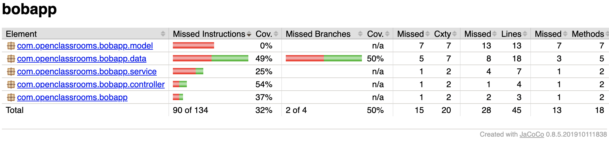

 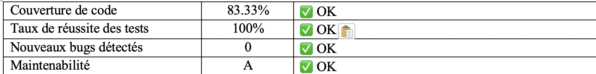

  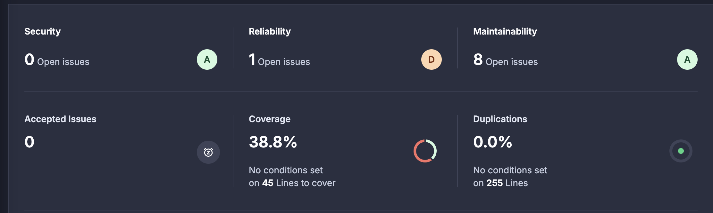

Analyse :
* La couverture de code du back-end dépasse 80%, ce qui est un bon point.
* Tous les tests ont réussi, garantissant la stabilité du back-end.
* La maintenabilité du code est bonne, avec une note "A" sur SonarCloud.

## Retour des utilisateurs et points d’amélioration
Problèmes identifiés :
📌 Back-end : Aucun problème majeur, mais nous devons maintenir la couverture des tests au-dessus de 80%.
📌 Front-end : La couverture de code est trop basse (76.92%). Nous devons ajouter des tests unitaires sur certaines parties du code.

Actions Correctives :
* Augmenter la couverture des tests sur le front-end :
* Identifier les fichiers/fonctions peu testés via le rapport de couverture.
* Ajouter des tests unitaires supplémentaires.
* Suivi des métriques à chaque exécution du pipeline :
* Vérifier régulièrement la qualité du code sur SonarCloud.
* Mettre à jour les KPI si nécessaire pour améliorer la robustesse du projet.